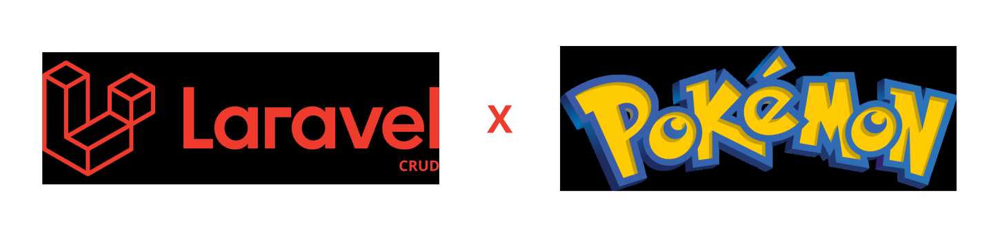
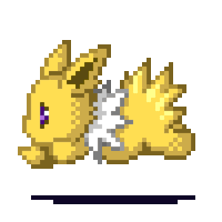
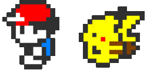
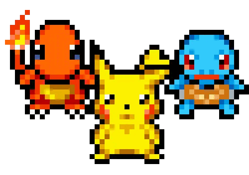

<p align="center"><a href="https://laravel.com" target="_blank"></a></p>

<p align="center">
<a href="#port"></a> &nbsp
<a href="#eng"></a>
</p>


<div id="port">
<br>

# Requisitos e instalação

<p align="center">
<a href="https://github.com/xJoaoPedro/laravel-pokemon/tree/pt-br"></a>
</p>

### Requisitos

<p align="center">
 
&nbsp

&nbsp

&nbsp

&nbsp

</p>

### Instalação e teste

Após clonar o repositório e certificar que todos os programas solicitados estão instalados, você deve alterar o nome do arquivo `.env.example` para `.env` e rodar os seguintes comandos no seu terminal (preferência git bash):



```
npm install
composer install
php artisan storage:link
php artisan key:generate
php artisan migrate
```

Agora com o projeto configurado, basta rodar os seguintes comandos:
```
npm run build
php artisan serve
```

E pronto! basta acessar seu `localhost` para testar o projeto!

<br>

# Sobre o projeto

Criada durante a cadeira de _Programação Web_, a aplicação trata-se de um CRUD temático sobre Pokémon, que permite a criação, leitura, atualização e exclusão de informações sobre o mundo Pokémon. Através desta aplicação web, é possível gerenciar as informações de suas entidades conforme:
- **Pokémon -** nome, tipo, poder, treinador e imagem.
- **Treinador -** nome e imagem. 

<div align="center">

</div>

## Tecnologias usadas

O sistema foi desenvolvido utilizando o framework _[Laravel](https://laravel.com)_, em uma arquitetura MVC (Model, View e Controller) para gerenciar as informações e utilizando o _[Blade](https://laravel.com/docs/11.x/blade)_ junto do framework _[Tailwind](https://tailwindcss.com/)_ para criação e estilização das views.

<div align="center">
 

</div>

## Autenticação e criação de perfil


<p align="left">

Além do CRUD completo de ambas entidades, a aplicação ainda implementa funcionalidades de log in e registro através do _[Laravel Breeze](https://laravel.com/docs/11.x/starter-kits#laravel-breeze)_, podendo visualizar os Pokémon e treinadores criados somente se estiver logado no sistema.
</p>

<br>

## Por que Laravel?


<p align="left"> 

O framework foi escolhido por oferecer diversas facilitações no desenvolvimento, como as _[Routes](https://laravel.com/docs/11.x/routing)_ para organizar as rotas e requisições, as _[Migrations](https://laravel.com/docs/11.x/migrations)_ e as _[Eloquent Relationships](https://laravel.com/docs/11.x/eloquent-relationships)_ que oferecem uma simplificação com o bancos de dados, bem como o _[Breeze](https://laravel.com/docs/11.x/starter-kits#laravel-breeze)_ citado anteriormente. 
</p>

</div>

<hr>
<div align="center">

</div>
<hr>

<div id="eng">
<br>

# Requirements and instalation

<p align="center">
<a href="https://github.com/xJoaoPedro/laravel-pokemon/tree/en-us"></a>
</p>

### Requirements

<p align="center">
 
&nbsp

&nbsp

&nbsp

&nbsp

</p>

### Instalation and test


After cloning the repository and ensuring that all required programs are installed, you should rename the `.env.example` file to `.env` and run the following commands in your terminal (preferably Git Bash):


```
npm install
composer install
php artisan storage:link
php artisan key:generate
php artisan migrate
```

Now that the project is configured, simply run the following commands:
```
npm run build
php artisan serve
```

And that's it! Just access your `localhost` to test the project!

<br>

# About the project

Created during the _Web Programming_ course, the application is a thematic CRUD about Pokémon, which allows the creation, reading, updating, and deletion of information about the Pokémon world. Through this web application, it is possible to manage the information of its entities as follows:
- **Pokémon -** name, type, power, trainer, and image.
- **Trainer -** name and image. 

<div align="center">

</div>

## Technologies used

The system was developed using the _[Laravel](https://laravel.com)_ framework, in an MVC (Model, View, and Controller) architecture to manage the information, and using _[Blade](https://laravel.com/docs/11.x/blade)_ along with the _[Tailwind](https://tailwindcss.com/)_ framework for creating and styling the views.

<div align="center">
 

</div>

## Authentication and profile creation


<p align="left">

In addition to the complete CRUD for both entities, the application also implements login and registration functionalities using _[Laravel Breeze](https://laravel.com/docs/11.x/starter-kits#laravel-breeze)_, allowing users to view the created Pokémon and trainers only if they are logged into the system.
</p>


<br>

## Why Laravel?


<p align="left"> 

The framework was chosen for offering several conveniences in development, such as _[Routes](https://laravel.com/docs/11.x/routing)_ to organize request routes, _[Migrations](https://laravel.com/docs/11.x/migrations)_ and _[Eloquent Relationships](https://laravel.com/docs/11.x/eloquent-relationships)_ that provide simplification with databases, as well as the previously mentioned _[Breeze](https://laravel.com/docs/11.x/starter-kits#laravel-breeze)_. 
</p>

</div>
